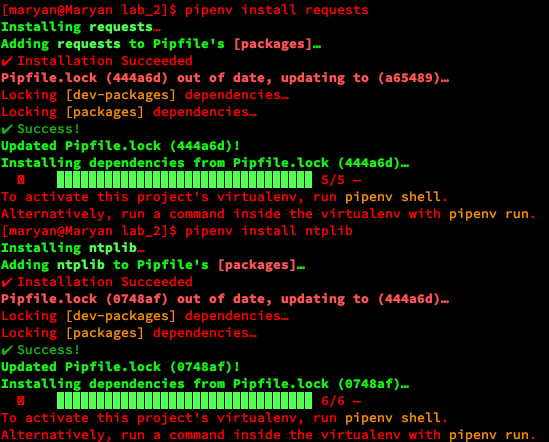
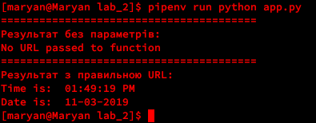
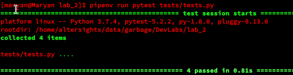
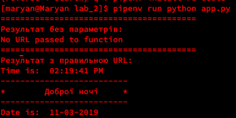

## Lab_2: Автоматизація. Знайомство з CI/CD.

### Хід роботи
1. Створив папку lab_2 з _README.md_ файлом.

2. За допомогою пакетного менеджера *PIP* інсталював `pipenv` та створив ізольоване середовище для Python. Ознайомився з командаю `pipenv -h`. Команди:i
```bash
pip install pipenv
pipenv --python 3.7
pipenv shell
```
    -   
    
3. Встановив бібліотеи  `requests`  та `ntplib`  у своєму середовищі. 
```bash
pipenv install requests
pipenv install ntplib
```
    - 

4. Створив файл `app.py`. Ознайомився з Python: [Python tutorial](https://www.tutorialspoint.com/python/index.htm)

5. Переконайтесь що програма працює правильно.
```bash
pipenv python app.py
```
    - 
    

6. Встановив бібліотеку `pytest`. Ознайомився з  [документацією pytest](https://docs.pytest.org/en/latest/#).
```bash
pipenv install pytest
```
    - 
    

7.  Тести виконуються успішно::
```bash
pipenv pytest tests/tests.py
```
    -  
    

8. :exclamation: (Захист) У програмі дописати функцію яка буде перевіряти час доби AM/PM та відповідно друкувати: Доброго дня/ночі;
    -  

9. :exclamation: (Захист) Написав тест що  перевіряє правильність виконання функції в app.py. Тест виконується успішно

10. Перенаправте результат виконання тестів у файл `results.txt` а також додайте результат виконання програми у кінець цього ж файл (append). Вкажіть у документації якою командою Ви це зробили;
11. Зробіть коміт із Вашими змінами до репозиторію.
12. Заповніть `Makefile` необхідними командами (bash) для повної автоматизації процесу СІ Вашого проекту (_дані директиви це по суті bash команди які Ви виконували у попередніх пунктах але трішки модифіковані_):
- директива install - повинна інсталювати середовище за допомогою pipenv;
- директива test - повинна запускати тести та записувати результат у файл;
- директива run - повинна виконувати програму та записувати результат у файл;
- директива deploy - повинна автоматично робити git commit/push файла `results.txt`;
13. Закомітьте зміни в `Makefile` до репозиторію та перейдіть на віртуальну машину Ubuntu;
14. Склонуйте git репозиторій на віртуальну машину Ubuntu. Перейдіть у папку лабораторної роботи та запустіть make:
```bash
make
```
- `make` / `pip` / `python` - повинен бути вже інстальовані;
- Результат виконання команди `make` має бути створене ізольоване середовище (venv), виконані тести, запущена програма та закомічений файл у git; 
15. Після успішного виконання роботи відредагуйте Ваш персональний _README.md_ у цьому репозиторію. Створіть таблицю яка ставить у відповідність номер лабораторної роботи та URL посилання на папку з виконаною роботою у Вашому персональному репозиторію. Створіть пул-реквест до основного репозиторію.
