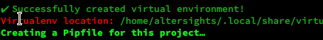
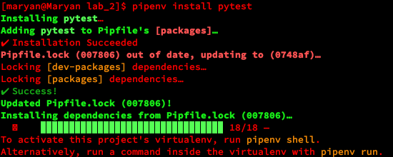

## Lab_2: Автоматизація. Знайомство з CI/CD.

### Хід роботи
1. Створив папку lab_2 з _README.md_ файлом.

2. За допомогою пакетного менеджера *PIP* інсталював `pipenv` та створив ізольоване середовище для Python. Ознайомився з командаю `pipenv -h`. Команди:i
```bash
pip install pipenv
pipenv --python 3.7
pipenv shell
```
  -   
    
3. Встановив бібліотеи  `requests`  та `ntplib`  у своєму середовищі. 
```bash
pipenv install requests
pipenv install ntplib
```
  - 

4. Створив файл `app.py`. Ознайомився з Python: [Python tutorial](https://www.tutorialspoint.com/python/index.htm)

5. Переконайтесь що програма працює правильно.
```bash
pipenv python app.py
```
  - 
    

6. Встановив бібліотеку `pytest`. Ознайомився з  [документацією pytest](https://docs.pytest.org/en/latest/#).
```bash
pipenv install pytest
```
  - 
    

7.  Тести виконуються успішно::
```bash
pipenv pytest tests/tests.py
```
  -  
    

8. :exclamation: (Захист) У програмі дописати функцію яка буде перевіряти час доби AM/PM та відповідно друкувати: Доброго дня/ночі;
  -  

9. :exclamation: (Захист) Написав тест що  перевіряє правильність виконання функції в app.py. Тест виконується успішно

10. Перенаправив результат виконання тестів у файл `results.txt` командою `pipenv run pytest tests/tests.py > results.txt` та результат виконання програми у кінець цього ж файлу командою `pipenv run python app.py >> results.txt`. 

11. Зробив  коміт зі змінами до репозиторію.

12. Заповніть `Makefile` необхідними командами (bash) для повної автоматизації процесу СІ  проекту.

13. Закомітьтив зміни в `Makefile` до репозиторію.

14. Склонуйте git репозиторій на чисту віртуальну машину. Перейшов  у папку лабораторної роботи та запустив make:
```bash
make
```
- 
15. Зроблено
