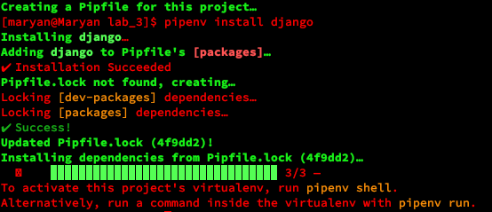
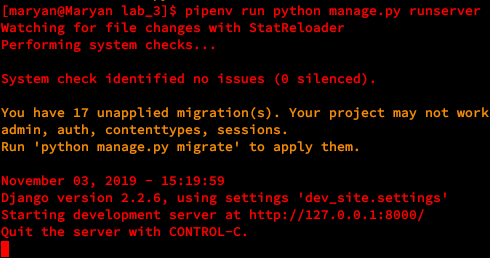
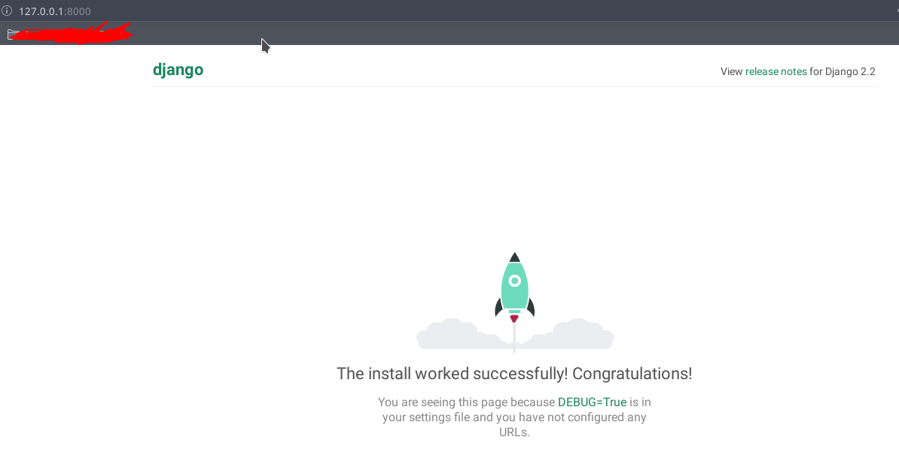
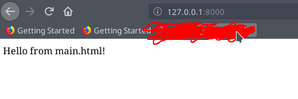
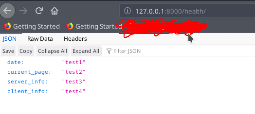

## Lab_3: Вступ до моніторингу.

### Хід роботи
1. Створіив папку з назвою лабораторної роботи у власному репозиторію. Перейшовши у папку ініціалізував середовище `pipenv` та встановив необхідні пакети:
    ```bash
    pipenv --python 3.7
    pipenv install django
    ```
  - 
  
2. За допомогою Django Framework створив заготовку (template)  проекту dev_site.  Для зручності виніс всі створені файли на один рівень вище щоб структура проекту була такою як показано нижче: 
    ```bash
    pipenv run django-admin startproject dev_site
    
    mv dev_site/dev_site/* dev_site/
    mv dev_site/manage.py ./
    ```
    ```text
    lab_3/
    ├── dev_site/
    │   ├── __init__.py
    │   ├── settings.py
    │   ├── urls.py
    │   └── wsgi.py
    └── manage.py
    ```
3. Переконався що все встановилось правильно, для цього  виконав команду вказану нижче та перейшов за посиланням яке вивелось у консолі (згідно дефолтних налаштувань потрібно перейти на localhost:8000):
    ```bash
    pipenv run python manage.py runserver
    ```
  - 
  - 
  
4. Зупинив сервер виконавши переривання `Ctrl+C`. Створив коміт із базовим темплейтом сайту. 
    > Після запуску сервера у поточні папці створився файл бези даних (`db.sqlite3`).
    > Для того щоб заборонити гіту відслідковувати цей файл та додавати його до комітів, я створив новий файл з назвою `.gitignore` та прописав в ньому назву файлу `db.sqlite3`
    > Таким чином гіт перевіряє вміст файлу `.gitignore` та виключає з комітів файли перечислені в ньому.
    
5. Cтворів темплейт додатку (app) з назвою "main". Створив коміт із новоствореними файлами темплейту додатка:
    ```bash
    pipenv run python manage.py startapp main
    ```
6. Cттворив папку `main/templates/`, а також у даній папці файл з розширенням `.html` (`main.html`). У папці `main/` створив файл `urls.py`. Зробив коміт із даними файлами;

7. Після створення додатку  вказав Django frameworks його назву та де шукати веб сторінки. Відредагував файли `my_site/settings.py` та `my_site/urls.py`;


8. Ознайомився із вмістом файла `main/views.py` та відредагував цей файл у своєму проекті.
    
9. Щоб поєднати функції із реальними URL шляхами за якими будуть доступні  веб сторінки заповнив файл `main/urls.py` згідно зразка.

10. Запустив сервер та переконався що сторінки доступні. Виконав коміт робочого Django сайту.
  -  
  -  *
  
  11. Встановив бібліотеку requests
    ```bash
    pipenv install requests
    ```
    
12.  Відкрив сторінку `health` у браузері:
  -  
  
13. Захист:
    1. модифікував функцію `health` так щоб у відповіді були: згенерована на сервері дата, URL сторінки моніторингу, інформація про сервер на якому запущений сайт та інформація про клієнта який робить запит до сервера;
        
    2. Дописав функціонал який буде виводити повідомлення про недоступність сайту у випадку якщо WEB сторінка недоступна

    3. Зробив так щоб дана програма запускалась раз в хвилину та працювала в бекграунді;
    
    4. Спростив роботу з пайтон середовищем через швидкий виклик довгих команд, для цього прописав необхідні команди у секцію `scripts` у Pipfile.
    
14. Запустив сервер та переконався  що головна сторінка відображається. Програма моніторингу також працює. Закомітив файл логів `server.logs` до репозиторію. 

15. Після успішного виконання роботи відредагував персональний _README.md_ у цьому репозиторію. Створив пул-реквест до основного репозиторію.
