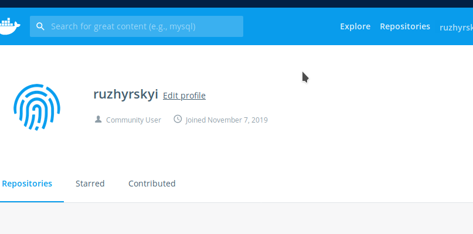
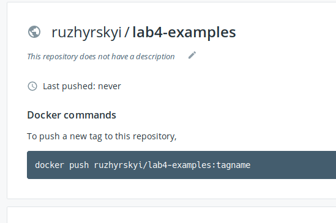
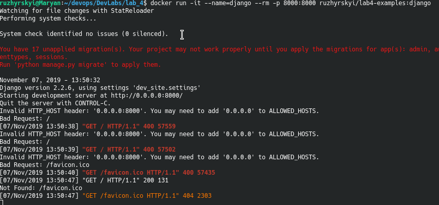
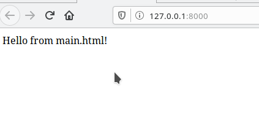
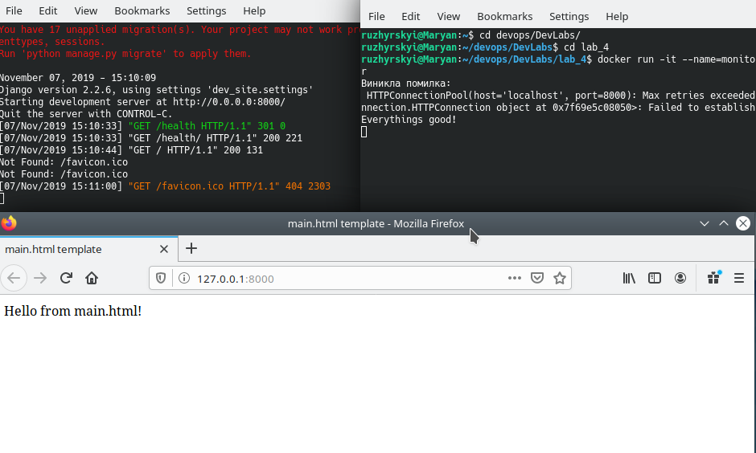

# Lab 4: Робота з Docker

## What to do

1. Встановив Docker та вдостовірився, що докер працює. Перенаправив вивід команд у файл `my_work.log`. Закомітив зміни.

2. Завантажив базовий імедж python-slim через команду `docker pull python:3.7-slim`:
- 

3. Створив файл `Dockerfile` та скопіював туди вміст файлу-зразка. Змінив посилання на власний репозиторій. Зробив коміт зі змінами.

4. Створив власний аккаунт та репозиторій на DockerHub:
- 
- 

6. Виконав білд image командою `docker build -t ruzhyrskyi/lab4-examples:django .`. Закомітив цей імедж до свого хабу командою `docker push ruzhyrskyi/lab4-examples:django`. [Посилання на репозиторій](https://hub.docker.com/r/ruzhyrskyi/lab4-examples). Видалити: `docker image rm ruzhyrskyi/lab4-examples:django`.

5. Запустив імедж командою `docker run -it --name=django --rm -p 8000:8000 ruzhyrskyi/lab4-examples:django`
- 
- 

6. Створив ще один докер-файл для програми моніторингу, зробив білд, запустив та запушив в докер-хаб:
- 

7. Витягнув логи наступним чимном:
    1. Створив volume - `docker volume create vol`
    2. Запустив імедж з прив'язкою до сховища (volume) - `docker run -it --rm --name=monitor -v vol:/app --net=host zuzhyrskyi/lab4-examples`
    3. Виконав копіювання файлу з логами в папку з лабораторною - `docker cp monitor:/app/server.log ./`

8. Закомітив всі зміни
