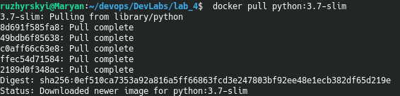

# Lab 4: Робота з Docker

## What to do

1. Встановив Docker та вдостовірився, що докер працює. Перенаправив вивід команд у файл `my_work.log`. Закомітив зміни.

2. Завантажив базовий імедж python-slim через команду `docker pull python:3.7-slim`:
- 

3. Створив файл `Dockerfile` та скопіював туди вміст файлу-зразка. Змінив посилання на власний репозиторій. Зробив коміт зі змінами.
