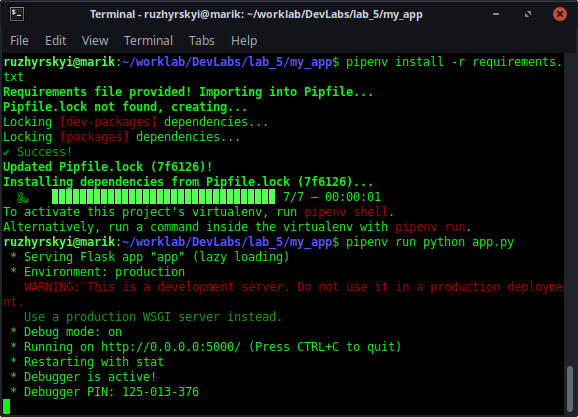
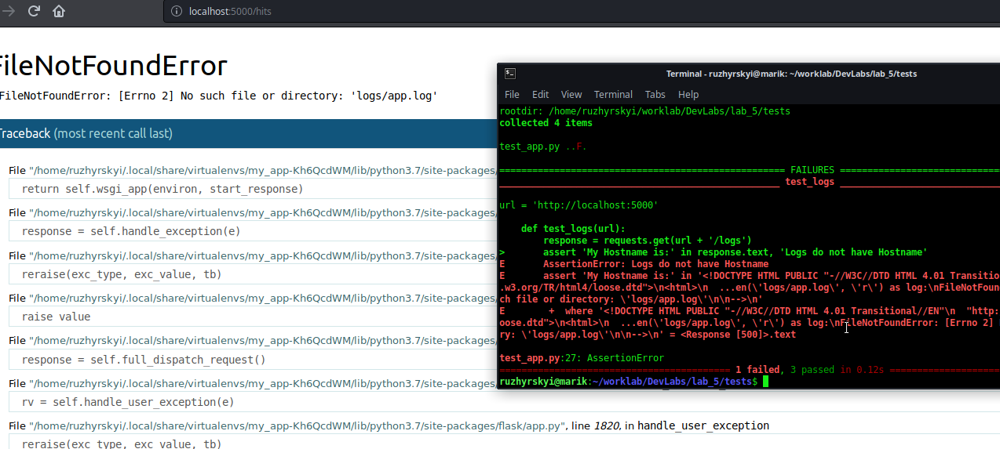
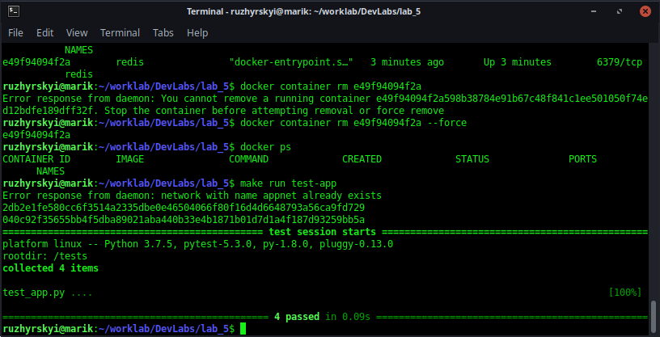
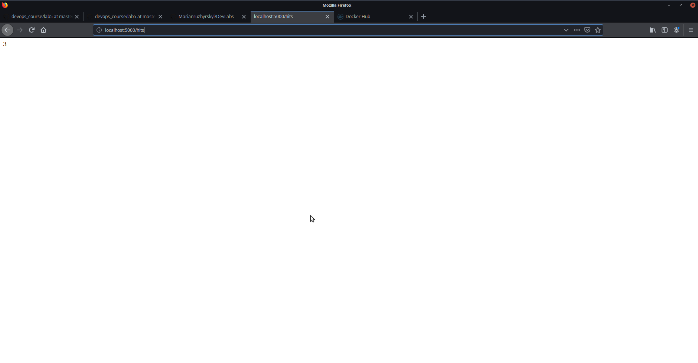
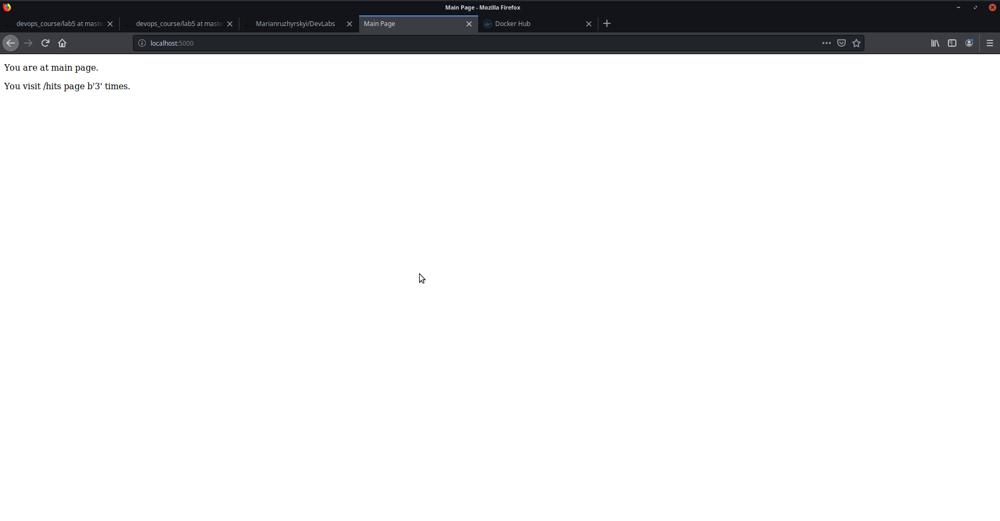
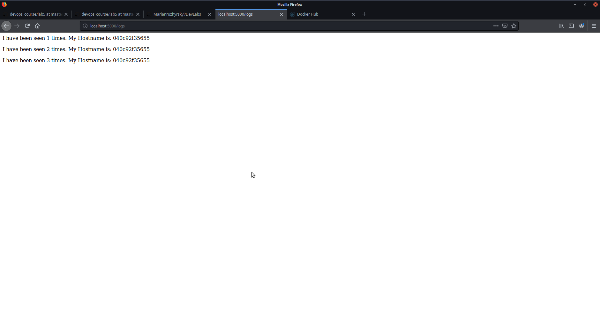

# Lab_5: Автоматизація за допомогою Makefile VS Docker Compose

1. Прочитав про докер за вказаним посиланням.
2. Прочитав про flask

## Розгортка проекту за доп. Makefile

1. Створив папку `my_app` та `tests`. Скопіював файли з репозиторію у свій. Файл `requirements.txt` містить найменування необхідних для роботи проекту залежностей (flask, redis, requests..).
2. Перевіряємо проект на працездатність:

- Сервер працює, але сповіщує про відсутність необхідної папки/файлу.

3. Створив імеджі (`make app tests`) та запустив (make run test-app):

4. Makefile директиви: 
- STATES - змінна мітить назви цілей, 
- REPO - змінна містить назву репозиторію.
- ціль $(STATES) вибирає одну, або по черзі ціль та виконує для неї вказані команди. В даному випадку створюється білд імеджу з вказаною назвою цілі.
- Run - створює мережу та запускає контейнери
- test-app - запускає тести
- docker-prune - очищує дані та контейнери

5. перевірив роботу сторінок в браузері:
- 
- 
- 

6. Створив ціль для завантаження імеджів в докерхаб - `make push` та завантажив створені раніше імеджі до свого репозиторію цією командою.
7. Створив директиву Makefile для видалення всіх локальних імеджів - `make cleanup`. Використав дану команду.

## docker-compose

1. Додав файл docker-compose та заповнив його.
2. Запустив білд через docker-compose. Вебсайт працює.
3. Зупинив проект, очистив імеджі та ресурси компоуз
4. На мою думку зручніше використовувати той спосіб, який буде найбільш оптимальним в конкретній ситуації. Докер композ та докер створені одне для одног, тому для розгортки проектів на докері буде зручніше використовувати компоуз (але це не точно).
5. docker-пушнув імеджі до віддаленого репозиторію (https://hub.docker.com/repository/docker/ruzhyrskyi/lab4-examples).

6. (ЗАВДАННЯ) Зробив docker-compose.yml для 4ї лабораторної та помістив його у папці з нею.